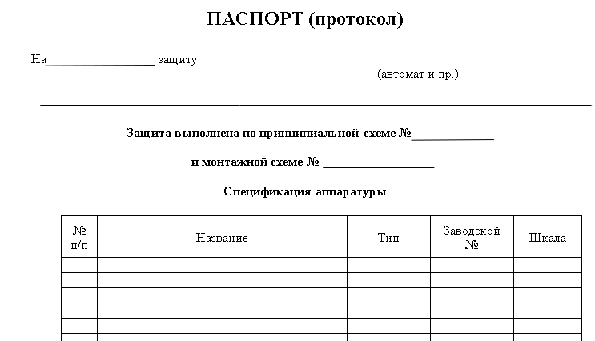

# ОПТИМИЗАЦИЯ ТЕХНИЧЕСКОЙ ДОКУМЕНТАЦИИ РЕМОНТНОГО ПРЕДПРИЯТИЯ НАПРАВЛЕНИЯ ЭНЕРГЕТИКА

## Цель:

* Создать приложение, которое поможет упростить задачи по ведению технической документации подразделения.

## Разделы:

### Обоснование целесообразности оптимизации

* [Предпосылки предложения.](#предпосылки-предложения)
* [Смысл перехода на новую систему ведения документации.](#смысл-перехода-на-новую-систему-ведения-документации)
* [Возможность перехода на электронный формат.](#возможность-перехода-на-электронный-формат)
* [Положительный эффект от внедрения.](#положительный-эффект-от-внедрения)

### Техническое описание приложения

* [Внешняя структура приложения.](#внешняя-структура-приложения)
* [Внутренняя структура приложения.](#внутренняя-структура-приложения)

### Обоснование целесообразности оптимизации

#### Краткое описание раздела:

`Перенос документации в электронный формат поможет снизить множество негативных факторов: ошибки, недолговечность, нечитабельность, доступность, хранение.`

#### Предпосылки предложения

Ремонтное предприятие направление энергетика отвечает за своевременное обслуживание, ремонт вверенного электрооборудования.

На каждое электрооборудование ведется различная документация согласно приказу министерства энергетики № 555 от 13.10.2022 года и согласно внутренним приказам организации.

Определенная часть из которых до сих пор ведется в бумажном формате, одним из таких документов является паспорт-протокол электрооборудования.

Паспорт-протокол - это документ-форма, которая заполняется по мере претерпевания устройством различных изменений, отражающий его историю технического обслуживания, сведения об изменениях уставок, сведения об о внесении изменений в схемы.

#### Смысл перехода на новую систему ведения документации

Основные минусы бумажного формата:

* Ошибки.

`Документ ведется письменно, нет алгоритма, который предупреждает неккорректно введенные данные, кроме ступенчатой системы проверки "работник-руководитель". Количество ошибок возврастает в период больших нагрузок (капитальные ремонты).`

* Дублирование записи.

`Существуют повторяющиеся участки в форме заполнение которых можно упростить используя шаблонизацию.`

* Небезопасное хранение.

`Необходимо безопасное помещение для хранения бумаг.`

#### Возможность перехода на электронный формат

Основние регламенты по которым ведутся большинство документов устанавливает министерство энергетики.

Недавние изменения в правилах от 13.10.2020 года № 555 касались введения корректив в отношении различных документов, норм из-за достижений в сфере информационных технологий.

Следовательно, министерство не запрещает введения данного улучшения, наоборот одобряет.

#### Положительный эффект от внедрения

* Предупреждение ошибок.

`Определенные алгоритмы не позволят пользователю внести неточные данные.`

* Переопределение.

`Возможность переиспользовать уже существующие данные.`

* Надежное храниние.
  
`Все данные будут лежать в надёжном месте с ограниченным доступом.`

* Непрерывная интеграция.
  
`Возможность внесения любых изменений в форму документов.`

### Техническое описание приложения

#### Внешняя структура приложения.

#### Внутренняя структура приложения.