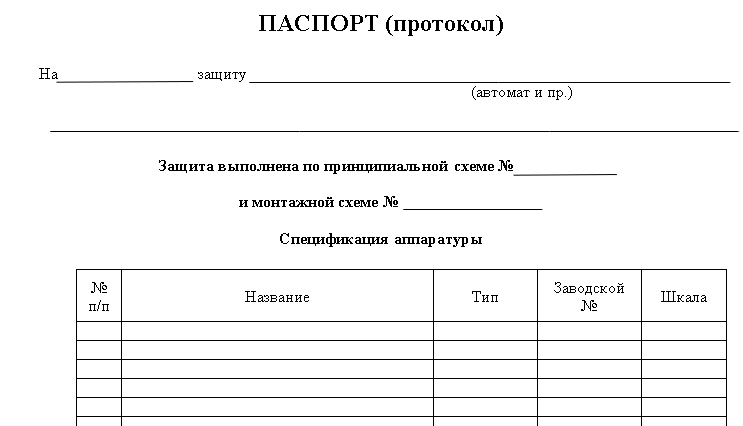
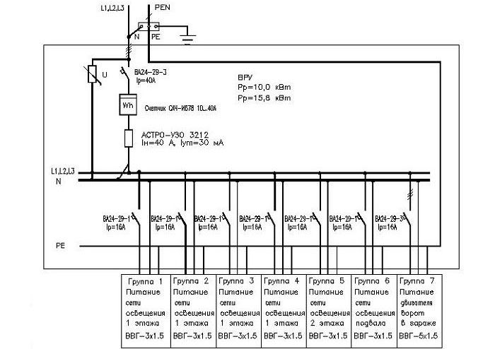
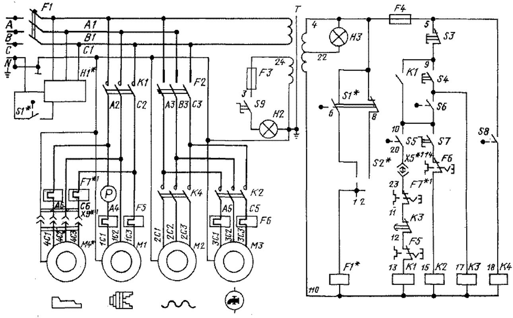
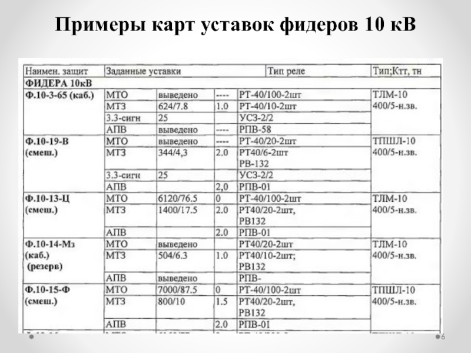

# **Документы подразделения релейной защиты и автоматики**

## **Разделы**

1. Основные документы подразделения.

---

### **Основные документы подразделения**

- [**Документы подразделения релейной защиты и автоматики**](#документы-подразделения-релейной-защиты-и-автоматики)
  - [**Разделы**](#разделы)
    - [**Основные документы подразделения**](#основные-документы-подразделения)
    - [**Предисловие**](#предисловие)
      - [**Паспорт-протокол**](#паспорт-протокол)
      - [**Принципиальная, однолинейная схема**](#принципиальная-однолинейная-схема)
      - [**Карта уставок**](#карта-уставок)

### **Предисловие**

Ремонтное предприятие направление энергетика отвечает за своевременное обслуживание, ремонт вверенного электрооборудования.

На каждое электрооборудование ведется различная документация согласно [приказу министерства энергетики № 555 от 13.07.2020 года](orders/Приказ%20минэнерго%20от%2013%20июля%202020%20Г.%20N%20555.pdf) и согласно внутренним приказам организации.

#### **Паспорт-протокол**

Паспорт-протокол - документ, предназначенный для учета результатов технического обслуживания устройства РЗА во время эксплуатации, начиная с проверки при новом включении (наладки), содержащий формуляр основных технических данных устройства РЗА.

[Форма паспорта-протокола](forms/Паспорт%20протокол.docx)

#### **Принципиальная, однолинейная схема**

Принципиа́льная схе́ма, принципиальная электри́ческая схема — графическое изображение (модель), служащее для передачи с помощью условных графических и буквенно-цифровых обозначений (пиктограмм) связей между элементами электрического устройства. 

Однолинейная схе́ма, однолинейная электри́ческая схема — графическое изображение (модель), служащее для передачи с помощью условных графических и буквенно-цифровых обозначений (пиктограмм) связей между элементами электрического устройства. 

#### **Карта уставок**

Карта уставок релейной защиты - технические данные об основных параметрах срабатывания и алгоритме функционирования устройств РЗА, находящиеся на щите управления объекта электроэнергетики, центра управления сетями (далее – ЦУС), ДЦ представленные в наглядной форме, необходимые для оценки действия устройств РЗА.

[**Вернуться на главную страницу**](../..//README.md)