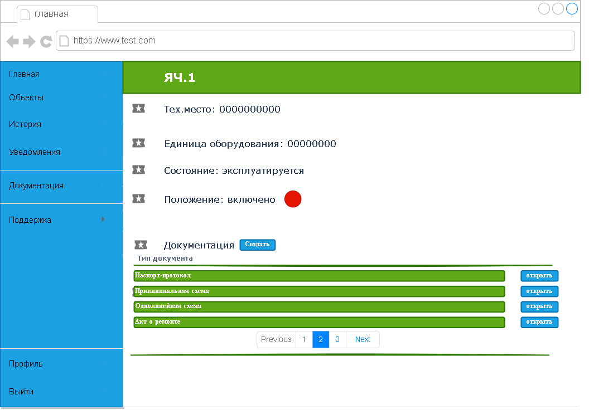

#  Оборудование

Страница оборудование содержит в себе основные данные по ячейке, а так же создание, чтение и редактированние информации по документам ячейки.

Информация на картинке предназначена для визуального представления, поля с данными поддвергнутся редактированию.

[**Вернуться на главную страницу**](../../../README.md)