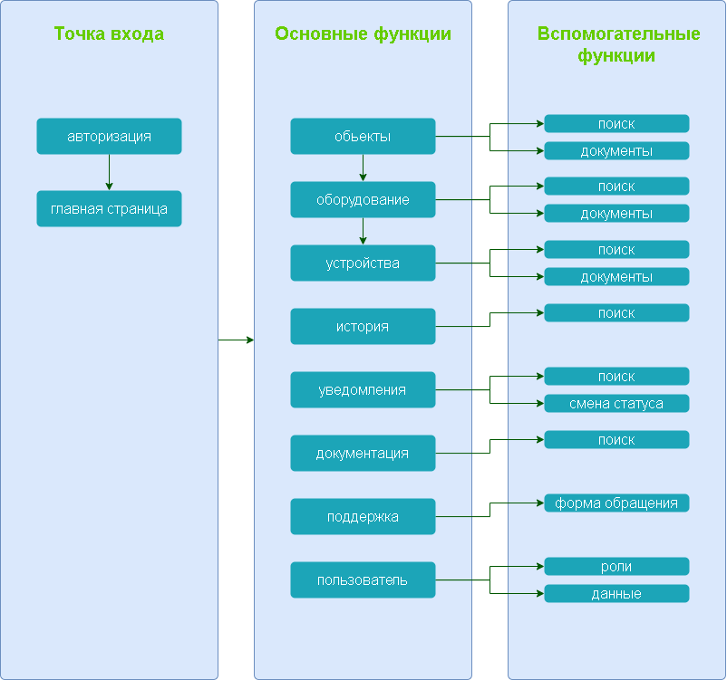

# Структура приложения

## Описание раздела

**Точка входа** - это место с которого пользователь начинает работу с приложением.

**Основные функции** - это главные сущности, которые пользователь использует.

**Вспомогательные функции** - это побочные сущности, которые пользователь применяет на своё усмотрение.

Меню содержит ссылки на визуальное представление функций.

[**Схема приложения находится здесь**](../../schemes/%D0%A1%D1%82%D1%80%D1%83%D0%BA%D1%82%D1%83%D1%80%D0%B0%20%D0%BF%D1%80%D0%B8%D0%BB%D0%BE%D0%B6%D0%B5%D0%BD%D0%B8%D1%8F.drawio)

### **Точка входа**

1. [авторизация](part-2-ui/1.md)
2. [главная страница](part-2-ui/2.md)

### **Основные функции**

1. [обьекты](part-2-ui/4.md)
2. [оборудование](part-2-ui/3.md)
3. [устройства](part-2-ui/5.md)
4. [история](part-2-ui/7.md)
5. [уведомления](part-2-ui/8.md)
6. [документация](part-2-ui/10.md)
7. [поддержка](part-2-ui/9.md)
8. [пользователь](part-2-ui/11.md)

### **Вспомогательные функции**

1. обьекты
   - [поиск](part-2-ui/3.md)
   - [документы](part-2-ui/3.md)
2. оборудование
   - [поиск](part-2-ui/4.md)
   - [документы](part-2-ui/4.md)
3. устройства
   - [поиск](part-2-ui/5.md)
   - [документы](part-2-ui/5.md)
4. история
   - [поиск](part-2-ui/7.md)
5. уведомления
   - [поиск](part-2-ui/8.md)
   - [смена статуса](part-2-ui/8.md)
6. документация
   - [поиск](part-2-ui/10.md)
7. поддержка
   - [форма обращения](part-2-ui/9.md)
8. пользователь
   - [роли](part-2-ui/11.md)
   - [данные](part-2-ui/11.md)

[**Вернуться на главную страницу**](../../README.md)